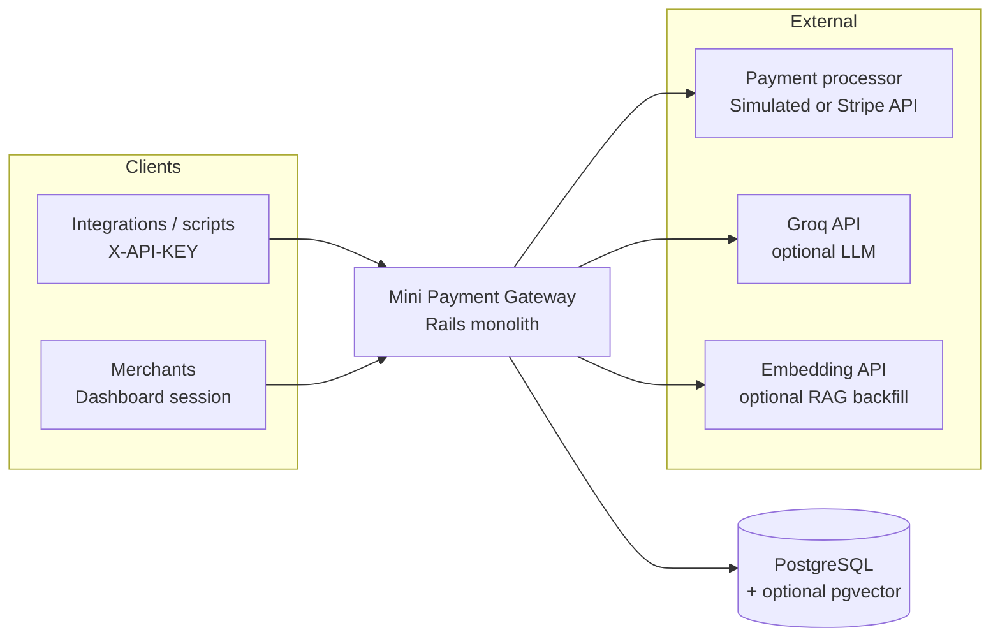
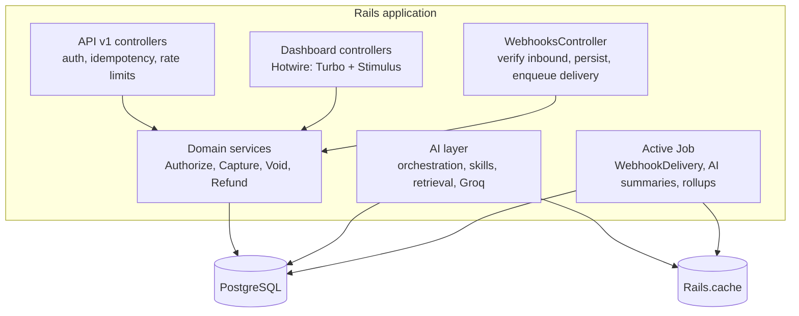
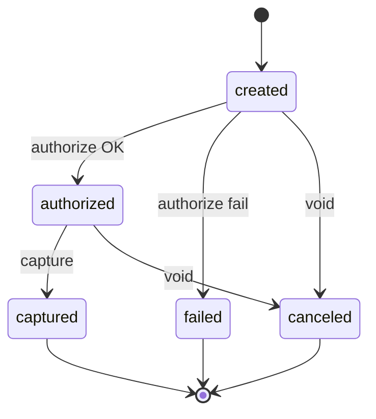
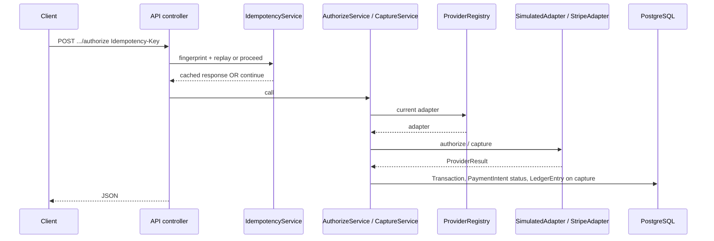
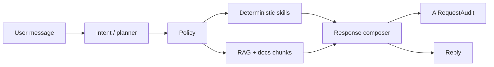

# Mini Payment Gateway

A **Rails 7.2** monolith that models a **merchant-scoped payment platform**: REST API, browser dashboard, full **authorize → capture → void / refund** lifecycle, a **ledger** of charges and refunds tied to transactions, **idempotency**, **webhooks** (inbound verification + outbound delivery), **structured logging**, **rate limiting**, **audit logs**, and an optional **AI assistant** (deterministic skills, workflows, RAG over `docs/`, policy guardrails, `AiRequestAudit`, replay, and dev-only analytics). The default payment **processor is simulated**; **Stripe test mode** is optional via pluggable adapters.

---

## System design & architecture

### Context (who talks to what)



### Logical containers



### Payment intent lifecycle (simplified)



Refunds update **`transactions`** and **`ledger_entries`**; the intent typically stays **`captured`** with a lower **refundable** balance (`refundable_cents` on `PaymentIntent`).

### Request flow: authorize and capture



### AI chat (high level)



For C4 diagrams, sequence details, and trade-offs, see **[docs/SYSTEM_DESIGN_SUMMARY.md](docs/SYSTEM_DESIGN_SUMMARY.md)** and **[docs/PROJECT_AT_A_GLANCE.md](docs/PROJECT_AT_A_GLANCE.md)**.

---

## Domain model (persistence)

| Area | Tables / concepts |
|------|-------------------|
| **Tenancy** | `merchants` (bcrypt `api_key_digest`, optional email/password for dashboard) |
| **Customers & instruments** | `customers`, `payment_methods` (token + display fields only; no PAN) |
| **Payments** | `payment_intents` (status, `amount_cents`, optional `idempotency_key` per merchant), `transactions` (kind: authorize, capture, void, refund; `processor_ref`) |
| **Money record** | `ledger_entries` (merchant-scoped; linked to capture/refund `transactions`) |
| **Reliability** | `idempotency_records` (merchant + key + endpoint → stored response) |
| **Observability** | `audit_logs`, `api_request_stats`, structured logs + request IDs |
| **Webhooks** | `webhook_events` (payload, delivery attempts, optional `provider_event_id` dedupe) |
| **AI** | `ai_chat_sessions`, `ai_chat_messages`, `ai_request_audits`, optional `doc_section_embeddings` (pgvector) |

---

## Tech stack

| Layer | Choice |
|-------|--------|
| Framework | Rails 7.2 (API mode for `/api`, classic MVC + assets for dashboard) |
| Database | PostgreSQL; optional **[pgvector](https://github.com/pgvector/pgvector)** for hybrid RAG |
| HTTP client | Faraday (e.g. Stripe adapter) |
| Auth | bcrypt (API keys); session for dashboard |
| Pagination | Kaminari |
| Realtime-ish UI | Hotwire (Turbo + Stimulus), importmap |
| Jobs | Active Job (`WebhookDeliveryJob`, `Ai::*`) |
| Quality | RSpec, RuboCop, Brakeman; GitHub Actions CI (pgvector image) |
| Deploy tooling | Kamal (optional) |

**Requirements:** Ruby **≥ 3.1** (CI uses 3.2). Use **Bundler** (`bundle install`); this is not a Node/npm project.

---

## Configuration (quick reference)

| Variable | Purpose |
|----------|---------|
| `PAYMENTS_PROVIDER` | `simulated` (default) or `stripe_sandbox` — see [docs/PAYMENT_PROVIDER_SANDBOX.md](docs/PAYMENT_PROVIDER_SANDBOX.md) |
| `STRIPE_SECRET_KEY` / `STRIPE_WEBHOOK_SECRET` | Required when `PAYMENTS_PROVIDER=stripe_sandbox` |
| `WEBHOOK_SECRET` | HMAC secret for webhook signing (inbound/outbound patterns per [docs/SECURITY.md](docs/SECURITY.md)) |
| `PROCESSOR_TIMEOUT_SECONDS` | Adapter HTTP timeout (default 3) |
| `GROQ_API_KEY` | LLM replies for AI features |
| `AI_VECTOR_RAG_ENABLED` | Hybrid retrieval; needs pgvector + embeddings backfill |
| `AI_CONTEXT_GRAPH_ENABLED` | Graph-expanded doc retrieval |

Full AI env table and RAG setup: section **AI Configuration** below and [docs/AI_AGENTS.md](docs/AI_AGENTS.md).

---

### Portfolio & interviews

| Doc | Purpose |
|-----|---------|
| [docs/PORTFOLIO_OVERVIEW.md](docs/PORTFOLIO_OVERVIEW.md) | Narrative, highlights, trade-offs |
| [docs/PROJECT_AT_A_GLANCE.md](docs/PROJECT_AT_A_GLANCE.md) | One-page architecture summary |
| [docs/INTERVIEW_DEMO_GUIDE.md](docs/INTERVIEW_DEMO_GUIDE.md) | Short demo paths |
| [docs/DEMO_SCRIPT.md](docs/DEMO_SCRIPT.md) | Detailed demo steps |
| [docs/PROJECT_BLURBS.md](docs/PROJECT_BLURBS.md) | Resume / LinkedIn blurbs |

---

## Setup

**Windows:** If `bundle` is not recognized, add Ruby to `PATH` (new terminals may need this, or set it in System Environment Variables):

```powershell
$env:Path = "C:\Ruby40-x64\bin;" + $env:Path
```

Use your actual Ruby install path if different (e.g. `C:\Ruby31-x64\bin`).

**Windows + Ruby 4.x:** If you see "Could not find 'fiddle'" when running `bundle install`, the Gemfile.lock is set up so the system Bundler can be used. Run `bundle install` again after ensuring compatible Bundler.

1. **Install dependencies**

   ```bash
   bundle install
   ```

2. **Database**

   ```bash
   bin/rails db:create
   bin/rails db:migrate
   bin/rails db:seed
   ```

   The seed prints API keys for test merchants — save them; they are not shown again.

3. **Run the app**

   ```bash
   bin/rails server
   ```

   Or `rails server` if `rails` is on your PATH.

4. **Optional: webhook secret**

   ```bash
   export WEBHOOK_SECRET="your_secret_key_here"
   ```

   On Windows PowerShell: `$env:WEBHOOK_SECRET = "your_secret_key_here"`. Development uses a default if unset.

### AI configuration

| Variable | Purpose |
|---------|---------|
| `GROQ_API_KEY` | Required for AI chat replies (Groq API). |
| `AI_CONTEXT_GRAPH_ENABLED` | Set to `true` or `1` for graph-expanded retrieval (seed + parent/next/links). |
| `AI_VECTOR_RAG_ENABLED` | Set to `true` or `1` for hybrid retrieval (keyword + vector). Requires pgvector and backfilled embeddings. |
| `AI_DEBUG` | Set to `true` or `1` to include debug panel in AI chat (retriever, section ids, budget, summary flags). Dev-oriented. |
| `EMBEDDING_API_KEY` or `OPENAI_API_KEY` | Used to backfill doc embeddings (e.g. `rake ai:backfill_doc_embeddings`). |

**Vector / hybrid retrieval:** Install the [pgvector](https://github.com/pgvector/pgvector#installation) Postgres extension, run migrations, set an embedding API key, then run `rake ai:backfill_doc_embeddings` for `docs/` sections. Enable with `AI_VECTOR_RAG_ENABLED=true`. Details: [docs/AI_AGENTS.md](docs/AI_AGENTS.md).

### Load / performance smoke tests

Deterministic local scenarios (stubbed processor + Groq, no outbound webhooks): `bundle exec rake perf:run` or `bin/load_test`. See [docs/LOAD_AND_PERFORMANCE_TESTING.md](docs/LOAD_AND_PERFORMANCE_TESTING.md).

### Tests & CI

Run the full suite locally (PostgreSQL required for tests):

```bash
RAILS_ENV=test bundle exec rails db:create db:schema:load
bundle exec rspec
```

GitHub Actions runs the suite against **PostgreSQL with pgvector**, splitting AI contract/scenario/policy tests and **AI skills** specs into separate jobs. See [.github/workflows/ci.yml](.github/workflows/ci.yml).

---

## API (`/api/v1`)

Most routes require the **`X-API-KEY`** header (see [docs/SECURITY.md](docs/SECURITY.md)).

### Health (no auth)

- `GET /api/v1/health` → `{ "status": "ok" }`

### Merchants

- `POST /api/v1/merchants` → **403** — creation is disabled; use dashboard sign-up at `/dashboard/sign_up`
- `GET /api/v1/merchants/me` → current merchant

### Customers & payment methods

- `GET /api/v1/customers` — list (paginated)
- `POST /api/v1/customers` — create
- `GET /api/v1/customers/:id` — show
- `POST /api/v1/customers/:customer_id/payment_methods` — create payment method

### Payment intents & refunds

- `GET|POST /api/v1/payment_intents` — list / create
- `GET /api/v1/payment_intents/:id` — show
- `POST /api/v1/payment_intents/:id/authorize` — authorize
- `POST /api/v1/payment_intents/:id/capture` — capture
- `POST /api/v1/payment_intents/:id/void` — void
- `POST /api/v1/payment_intents/:payment_intent_id/refunds` — create refund

Use **`Idempotency-Key`** (and consistent bodies) on mutating calls where supported — see `IdempotencyService`.

### Webhooks

- `POST /api/v1/webhooks/processor` — inbound processor events (signature verified per active adapter; no merchant API key)

### AI

- `POST /api/v1/ai/chat` — merchant-scoped AI chat (`{ "message": "..." }`). See [docs/AI_AGENTS.md](docs/AI_AGENTS.md).

---

## Dashboard (`/dashboard`)

Session-based UI for merchants (sign up, sign in with email/password or API key):

- **Overview** — landing after login
- **Transactions** — filterable list
- **Payment intents** — list, show, create, authorize, capture, void, refund
- **Ledger** — charges, refunds, fees, net volume (as implemented)
- **Webhooks** — outbound activity / configuration views
- **Account** — API key regeneration, credentials
- **AI** — chat UI; optional audit views

Dev-only routes (not available in production): `/dev/ai_playground`, `/dev/ai_analytics`, `/dev/ai_health`, `/dev/ai_audits`, replay — see `DevRoutesConstraint`.

---

## Implementation status (phases)

- **Phase 0:** Rails + Postgres, API skeleton, auth, health
- **Phase 1:** Models, migrations, seeds
- **Phase 2:** Controllers, serializers, pagination, errors
- **Phase 3:** Services, idempotency, ledger, state transitions
- **Phase 4:** Webhooks (inbound + async outbound delivery, retries)
- **Phase 5:** Structured logging, rate limits, audit logs, observability
- **Ongoing:** AI platform (skills, evals, CI gates — see [docs/AI_CI_QUALITY_GATES.md](docs/AI_CI_QUALITY_GATES.md))

---

## Seed data

After `bin/rails db:seed`:

- Test merchants with API keys (printed once — save them)
- Sample customers, payment methods, payment intents, transactions, ledger rows

---

## Further reading

| Topic | Doc |
|-------|-----|
| Payment lifecycle | [docs/PAYMENT_LIFECYCLE.md](docs/PAYMENT_LIFECYCLE.md) |
| Provider adapters | [docs/PROVIDER_ADAPTER_ARCHITECTURE.md](docs/PROVIDER_ADAPTER_ARCHITECTURE.md) |
| Security | [docs/SECURITY.md](docs/SECURITY.md) |
| API rate limits | [docs/API_RATE_LIMITING.md](docs/API_RATE_LIMITING.md) |
| AI platform | [docs/AI_PLATFORM.md](docs/AI_PLATFORM.md) |
| Deployment | [docs/DEPLOYMENT.md](docs/DEPLOYMENT.md) |
