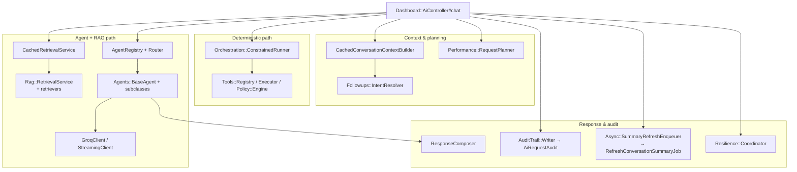

# C4 Level 3 — Component view (major modules)

Components are **cohesive Ruby modules** inside the Rails monolith. Arrows mean “calls / reads / writes” in the typical happy path.

## Payment & platform components

```mermaid
flowchart LR
  subgraph API["API / Dashboard controllers"]
    PIC[PaymentIntentsController\n(api + dashboard)]
    RC[RefundsController]
    WH[WebhooksController#processor]
  end

  subgraph Services["Payment services"]
    AUTH[AuthorizeService]
    CAP[CaptureService]
    VOID[VoidService]
    REF[RefundService]
    LED[LedgerService]
    IDEM[IdempotencyService]
    PES[ProcessorEventService]
    WDS[WebhookDeliveryService]
    WSS[WebhookSignatureService\nlegacy HMAC for simulated]
  end

  subgraph Provider["Provider layer"]
    REG[Payments::ProviderRegistry]
    ADP[Payments::Providers::*\nSimulated / Stripe]
  end

  subgraph Data["Persistence"]
    PI[(PaymentIntent)]
    TX[(Transaction)]
    LE[(LedgerEntry)]
    WE[(WebhookEvent)]
    IR[(IdempotencyRecord)]
    AL[(AuditLog)]
  end

  PIC --> IDEM
  PIC --> AUTH
  PIC --> CAP
  PIC --> VOID
  RC --> IDEM
  RC --> REF

  AUTH --> REG
  CAP --> REG
  VOID --> REG
  REF --> REG
  REG --> ADP

  AUTH --> TX
  AUTH --> PI
  CAP --> LED
  REF --> LED
  AUTH --> AL
  CAP --> AL

  AUTH -->|WebhookTriggerable| PES
  CAP -->|WebhookTriggerable| PES
  REF -->|WebhookTriggerable| PES

  PES --> WE
  WH --> REG
  WH --> WE
  WDS --> WE
```

### Component cheat sheet

| Component | Owns | Consumes | Produces / side effects | Must not |
|-----------|------|----------|-------------------------|----------|
| **`Api::V1::PaymentIntentsController`** | HTTP contract, idempotency orchestration for authorize/capture/void | `current_merchant`, `IdempotencyService`, `*Service` | JSON responses; stores idempotent responses | Business rules for amounts/ledger (delegate to services) |
| **`Api::V1::RefundsController`** | Refund HTTP validation (state, amount) | `RefundService`, idempotency | 201 + updated intent snapshot | Double-charge ledger (service enforces) |
| **`AuthorizeService`** | Auth attempt + intent status | `Payments::ProviderRegistry`, `Timeout`, `Auditable`, `WebhookTriggerable` | `Transaction(authorize)`, PI `authorized`/`failed`, audit, `ProcessorEventService` | Skip DB transaction wrapper for money movement rules |
| **`CaptureService`** | Capture + charge ledger | Provider adapter, `LedgerService`, concerns | `Transaction(capture)`, PI `captured`, **charge** `LedgerEntry`, webhooks | Create charge on authorize (by design) |
| **`VoidService`** | Void attempt | Provider adapter, `Auditable` | `Transaction(void)`, PI `canceled` on success | Ledger entry on void (none — correct) |
| **`RefundService`** | Refund + refund ledger | Provider adapter, `LedgerService` | `Transaction(refund)`, **refund** ledger (negative amount), webhooks | Refund without captured state (controller/service guard) |
| **`LedgerService`** | Ledger invariants | `Merchant`, `Transaction` | `LedgerEntry` | Provider HTTP |
| **`IdempotencyService`** | Deduping mutating requests | `IdempotencyRecord` | Cached JSON response or placeholder row | Vary semantics by endpoint without updating `request_hash` rules |
| **`ProcessorEventService`** | Merchant-facing webhook event creation | `WebhookSignatureService` (HMAC with `Rails.application.config.webhook_secret`) | `WebhookEvent` pending + signature; `after_commit` enqueues job | Inbound Stripe verification (different path) |
| **`WebhookDeliveryService`** | Outbound HTTP to merchant | `WebhookEvent`, `MERCHANT_WEBHOOK_URL` | Delivery status, retries via job | Change inbound processor schema |
| **`Payments::ProviderRegistry` + adapters** | External processor I/O + inbound webhook verify/normalize | ENV, Faraday (Stripe) | `Payments::ProviderResult`; boolean verify; normalized event hash | PI status transitions (services own) |

---

## AI subsystem components (dashboard-heavy)



### AI component cheat sheet

| Component | Owns | Consumes | Produces | Must not |
|-----------|------|----------|----------|----------|
| **`Dashboard::AiController`** | End-to-end dashboard chat orchestration, rate limit, streaming branch | Session merchant, `AiChatSession`, all AI services below | JSON (+ optional SSE); persists user/assistant messages | Embed provider-specific payment rules in prompts (keep in tools/docs) |
| **`CachedConversationContextBuilder`** | Cached memory inputs | `AiChatSession`, `Rails.cache` policy | `recent_messages`, `summary_text`, etc. | LLM calls |
| **`Followups::IntentResolver`** | Deterministic follow-up detection + inherited context | Recent messages, `Tools::IntentDetector` (for prior tool hints) | `intent`, `followup` hashes | Open-ended LLM classification |
| **`RequestPlanner`** | `ExecutionPlan` (skip memory/retrieval budget, mode) | Intent resolution, `AgentRegistry` definitions | Struct consumed by controller | Execute tools |
| **`ConstrainedRunner`** | ≤2-step deterministic tool orchestration | `resolved_intent`, `Policy::Engine`, `Tools::Executor` | `RunResult` (reply, tool names, explanation metadata) | Unbounded tool chains |
| **`CachedRetrievalService` / `RetrievalService`** | Doc context + citations | Feature flags, corpus state, optional vector index | `context_text`, `citations`, `debug` | Persist retrieval to DB as source of truth |
| **`Router` / `AgentRegistry`** | Agent selection + capability metadata | Message text, registry definitions | `agent_key`, agent class | Payment mutations |
| **`Agents::BaseAgent`** | Prompt assembly, guardrail pipeline hooks, Groq call | Context, memory text, citations | `AgentResult` | Direct DB writes |
| **`Guardrails::Pipeline`** | Pre/post LLM safety (empty context, citations, leaks) | Built messages + retrieval context | May short-circuit LLM | Replace audit trail |
| **`ResponseComposer`** | Stable client-facing reply shape | Agent output, tool path output | `composition` hash for audits | Business ledger |
| **`AuditTrail::Writer` / `AiRequestAudit`** | Durable AI request metadata | Controller-provided fields (no raw secrets in normal path) | DB row for analytics/replay | Store full raw prompts if policy forbids |
| **`Resilience::Coordinator`** | Safe fallback on failures | Exception, stage hints | JSON payload for error responses | Silent swallow without audit/logging |
| **Dev tooling** (`Dev::AiAuditsController`, playground, analytics, health) | Internal observability UX | `AiRequestAudit`, feature flags | HTML/JSON views | Production exposure (constraint blocks) |

### API AI chat (`Api::V1::Ai::ChatController`)

**Narrower than dashboard:** `Router` → `CachedRetrievalService` → `AgentRegistry` agent → `ResponseComposer` (via inline composition) → `write_ai_audit` / event log. **No** `IntentResolver`, **no** `RequestPlanner`, **no** `ConstrainedRunner` in this controller (as implemented).

---

## Design choices & trade-offs

| Choice | Benefit | Cost |
|--------|---------|------|
| Monolith | Simple transactions, one deploy, easy refactors | Single scalability blast radius |
| `merchant_id` scoping | Clear tenancy | Every query must stay disciplined |
| Deterministic tools first (dashboard) | Cost/latency/predictability | Maintenance of intent detection + policy rules |
| LLM + RAG | Flexible answers from docs | Quality tied to corpus; external dependency |
| Simulated + adapter Stripe | Local/CI friendly; real sandbox optional | Two behavioral modes to test |
| Rich AI audit + replay | Debuggability | Schema evolution must stay backward compatible |

## Safe to evolve vs risky to change

### Safer (local impact)

- Dashboard copy, Stimulus widgets, non-contract analytics aggregations
- New doc sections for RAG (content)
- New **read-only** tools registered with policy definitions
- Dev-only views and playground UX

### Riskier (systemic)

- Order of operations in `Dashboard::AiController#chat` (planner vs orchestration vs retrieval)
- `Policy::Engine` allow/deny tables affecting orchestration
- `IdempotencyService` hashing / endpoint keys
- `LedgerService` semantics (signs, entry types)
- `AiRequestAudit` payload contracts consumed by replay/CI
- Provider adapter mappings (`verify_webhook_signature`, `normalize_webhook_event`, Stripe field mapping)
- `ResponseComposer` / client JSON shape
