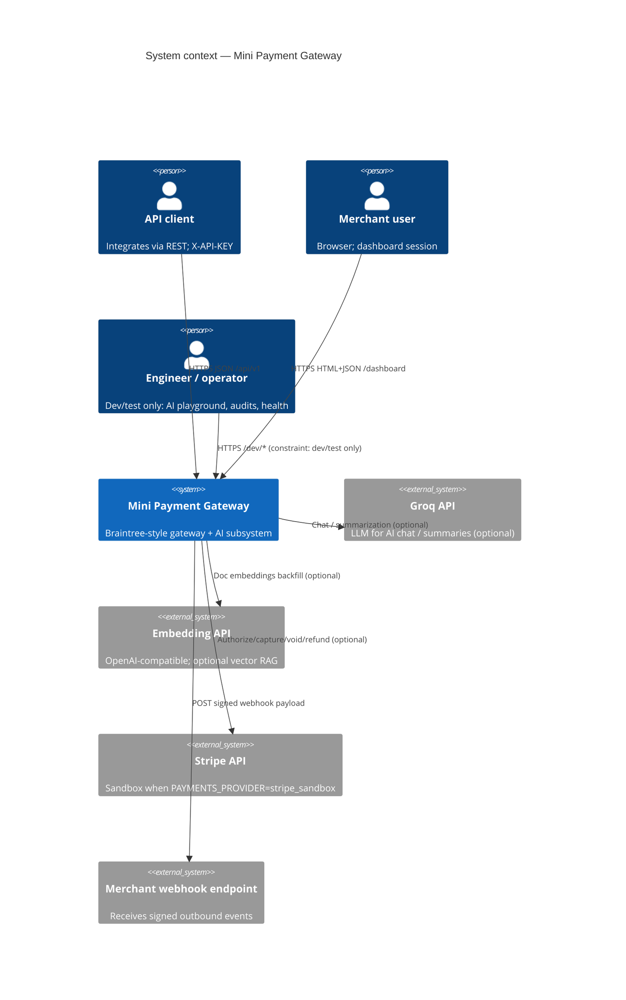

# C4 Level 1 — System context

**System:** Mini Payment Gateway (Rails application)

## Purpose

Provide merchants with:

- Programmatic payment operations (intents, authorize/capture/void/refund) via REST
- A browser dashboard for the same domain operations
- Webhook ingestion (processor → gateway) and **outbound** webhook delivery (gateway → merchant endpoint)
- Optional AI assistant over merchant data and internal docs

All merchant data is **isolated by `merchant_id`**.

## Context diagram (Mermaid)



> **Note:** GitHub may not render `C4Context` Mermaid. If it fails, use the ASCII view below or a Mermaid-compatible viewer.

## ASCII context (portable)

```
                    ┌─────────────────────────────────────┐
                    │     Mini Payment Gateway (Rails)    │
  API clients ─────►│  REST /api/v1  (X-API-KEY)          │
  Dashboard users ►│  /dashboard  (session)             │
  Dev users* ──────►│  /dev/*  (AI tooling, constrained)  │
                    │                                     │
                    │  PostgreSQL  │  Rails.cache  │ Jobs   │
                    └──────┬──────────────┬──────────┬─────┘
                           │              │          │
              optional     │              │          └──► Merchant webhook URL
              ┌────────────┴──────────────┴──────────────┐
              │ Stripe sandbox (if configured)          │
              │ Groq (AI)                                 │
              │ Embedding API (vector RAG)              │
              └─────────────────────────────────────────┘

* Dev routes: `DevRoutesConstraint` — not available in production.
```

## Responsibilities (what lives inside the boundary)

| Responsibility | Owner |
|----------------|--------|
| Payment intent lifecycle, transactions, ledger | App services + ActiveRecord |
| Idempotency for mutating API calls | `IdempotencyService` + `IdempotencyRecord` |
| Audit trail for payment actions | `Auditable` + `AuditLogService` |
| Inbound processor webhook verify + store | `Api::V1::WebhooksController` + provider adapter |
| Outbound webhook signing + delivery | `ProcessorEventService` / `WebhookDeliveryService` + `WebhookDeliveryJob` |
| AI routing, tools, RAG, guardrails, audit | `app/services/ai/**` + controllers |

## Outside the boundary

| External | Relationship |
|----------|--------------|
| **Stripe** (optional) | Real sandbox card rails when `PAYMENTS_PROVIDER=stripe_sandbox` |
| **Simulated processor** (default) | Randomized success in `Payments::Providers::SimulatedAdapter` — no HTTP |
| **Groq** | LLM; required for live AI replies in non-test envs that call the model |
| **Merchant’s HTTPS endpoint** | Receives outbound webhooks (`MERCHANT_WEBHOOK_URL` in current code path) |

## Actors

| Actor | Entry |
|-------|--------|
| **API client** | `/api/v1/*` |
| **Dashboard user** | `/dashboard/*` |
| **Processor / partner** (simulated or Stripe) | Sends events to `/api/v1/webhooks/processor` (signature scheme depends on provider) |
| **Internal operator (dev)** | `/dev/ai_playground`, `/dev/ai_audits`, etc. |
