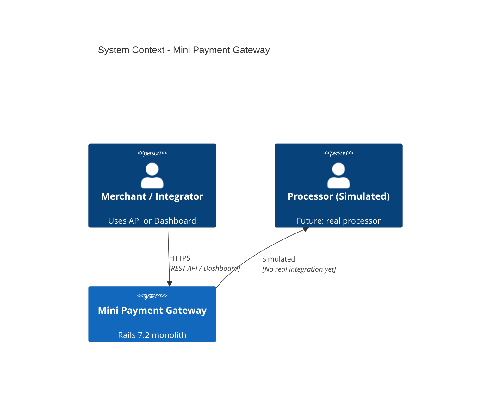
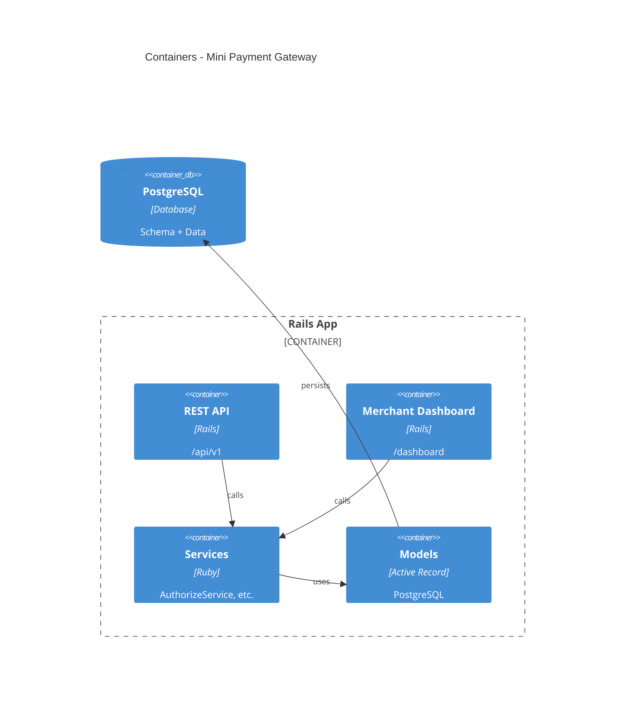
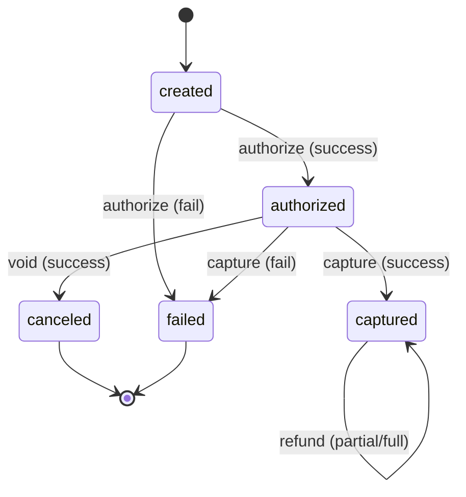
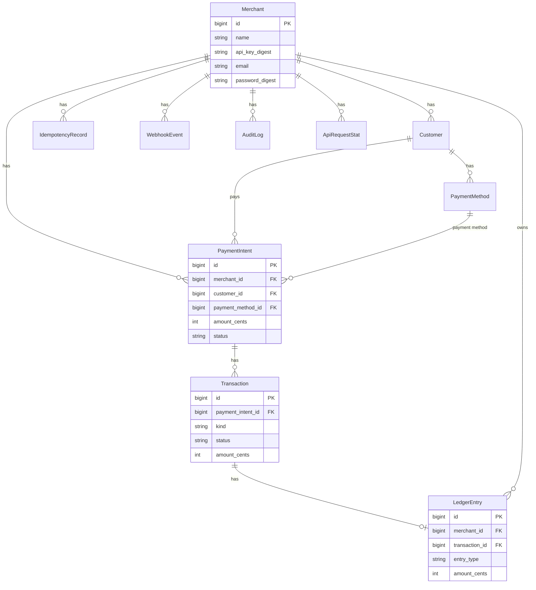

# Mini Payment Gateway – Diagrams

Text-based and Mermaid diagrams. For Mermaid, use GitHub, VS Code Mermaid extension, or [mermaid.live](https://mermaid.live).

---

## 1. System Context (C4 Level 1)



---

## 2. Container Diagram (High-Level)



---

## 3. Payment State Machine



---

## 4. Entity Relationship (Simplified)



---

## 5. Request Flow (API Authorize)

```
[Client]  POST /api/v1/payment_intents/1/authorize
    │         X-API-KEY: xxx
    │
    ▼
[Api::V1::PaymentIntentsController#authorize]
    │
    ├─► ApiAuthenticatable: current_merchant
    ├─► IdempotencyService.call
    │       └─► if cached → return 200 + cached body
    │
    ├─► AuthorizeService.call
    │       ├─► Transaction.create!
    │       ├─► PaymentIntent.update!
    │       ├─► ProcessorEventService (WebhookEvent)
    │       └─► AuditLogService
    │
    ├─► IdempotencyService.store_response
    └─► render JSON 200
```

---

## 6. Directory Map (Logical)

```
app/
  controllers/
    api/v1/          ← API surface
    dashboard/       ← Dashboard surface
    concerns/        ← Shared behavior
  models/            ← Domain entities
  services/          ← Business logic (payments, ledger, webhooks)
  jobs/              ← Async (WebhookDeliveryJob)
  middleware/        ← RequestIdMiddleware
```
