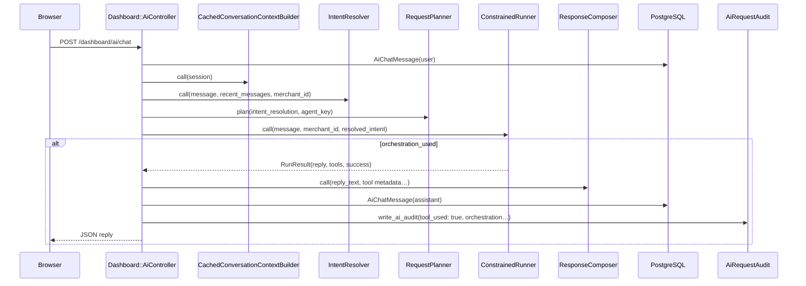
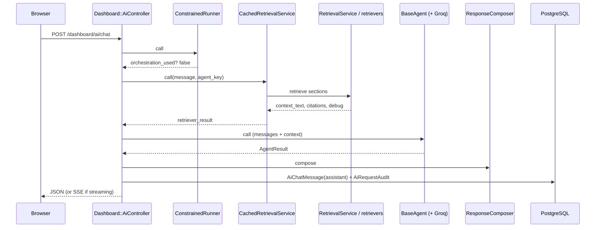

# Sequence documentation — AI flows

Two **different** implementations exist:

| Surface | Controller | Characteristics |
|---------|------------|-----------------|
| **Dashboard** | `Dashboard::AiController#chat` | Follow-up resolution, `RequestPlanner`, **ConstrainedRunner** (tools) **before** agent path, memory, optional streaming, richer audit |
| **API** | `Api::V1::Ai::ChatController#create` | `Router` → `CachedRetrievalService` → agent → audit (no orchestration branch in controller) |

Both are **merchant-scoped**. API uses `X-API-KEY`; dashboard uses **session** (`current_merchant`).

**Optional / flags:** graph retrieval, vector hybrid RAG, streaming, AI debug — via `Ai::Config::FeatureFlags` and params (see `AI_AGENTS.md`).

---

## A. Dashboard AI — deterministic / orchestration path

**When it runs:** `Ai::Orchestration::ConstrainedRunner.call` returns `orchestration_used? == true` (clear tool intent + policy allows; up to **2** tool steps).

**Rough order in `Dashboard::AiController#chat`:**

1. Parse/rate-limit message; set `Thread.current[:ai_request_id]`.
2. **Persist user message** on `AiChatSession`.
3. `CachedConversationContextBuilder` → `Followups::IntentResolver` (intent + followup hash).
4. `Router` (if agent param not fixed) + `RequestPlanner.plan` → `ExecutionPlan` (audit metadata; may skip memory on standalone agents).
5. **`ConstrainedRunner.call`** with `resolved_intent:`.
6. If orchestration used:
   - `ResponseComposer` from tool/deterministic output (citations typically empty).
   - Persist **assistant** `AiChatMessage`.
   - `write_ai_audit` with `tool_used: true`, orchestration fields, `execution_plan_metadata`.
   - `enqueue_summary_refresh_if_ok` (non-blocking; may no-op).
   - JSON response (+ optional debug).

### Mermaid (orchestration)

### What this path does **not** do

- Does **not** call `CachedRetrievalService` / `RetrievalService` in the same request (citations empty).
- Does **not** run `Agents::BaseAgent` LLM path for that turn.

---

## B. Dashboard AI — agent + retrieval path

**When it runs:** `ConstrainedRunner` does **not** claim the request (`orchestration_used?` false).

**Rough order:**

1. Steps 1–5 same as above (context, intent, planner).
2. **Memory branch:** If `execution_plan.memory_skipped?` → empty memory struct; else `MemoryBudgeter` over session summary + recent messages.
3. **Retrieval:** `CachedRetrievalService.call(message, agent_key:, **retrieval_opts)`  
   - `retrieval_opts` may include `max_sections: 3` when planner marks reduced budget.
   - Under the hood: `Ai::Rag::RetrievalService` chooses retriever based on **feature flags** (docs / graph / hybrid).
4. **Agent:** `AgentRegistry.fetch(agent_key)` → `build_agent` → `agent.call`
   - `BaseAgent` builds messages (system rules + optional `Memory:` + RAG context), runs **guardrail pipeline**, may call **GroqClient**.
5. `ResponseComposer` → persist assistant message → `write_ai_audit` / event log → `enqueue_summary_refresh_if_ok`.
6. Optional **`streaming_requested?`** → `perform_streaming_chat` (SSE) instead of single JSON `agent.call`.

### Mermaid (agent + RAG)

### Failure path

- `rescue` → `Ai::Resilience::Coordinator` → JSON payload; dashboard returns **500** with resilience payload in normal rescue path (see controller).

---

## C. API AI chat (narrower path) — summary

`Api::V1::Ai::ChatController#create`:

1. Rate limit + parse `message`.
2. `agent_key = Ai::Router.new(message).call`
3. `CachedRetrievalService.call(message, agent_key:)`
4. `AgentRegistry.fetch` + `build_agent` + `agent.call`
5. `write_ai_audit` (endpoint `api`); **memory_used false** in audit fields as implemented
6. JSON response; resilience rescue returns fallback payload (status see controller — **note:** differs from dashboard 500 behavior)

**Intentionally absent vs dashboard:** `IntentResolver`, `RequestPlanner`, `ConstrainedRunner`, session memory — simpler and cheaper.

---

## Async: conversation summary

After successful dashboard chat, `enqueue_summary_refresh_if_ok` may enqueue `Ai::RefreshConversationSummaryJob`, which calls `Ai::ConversationSummarizer` (Groq) **off request path**.
