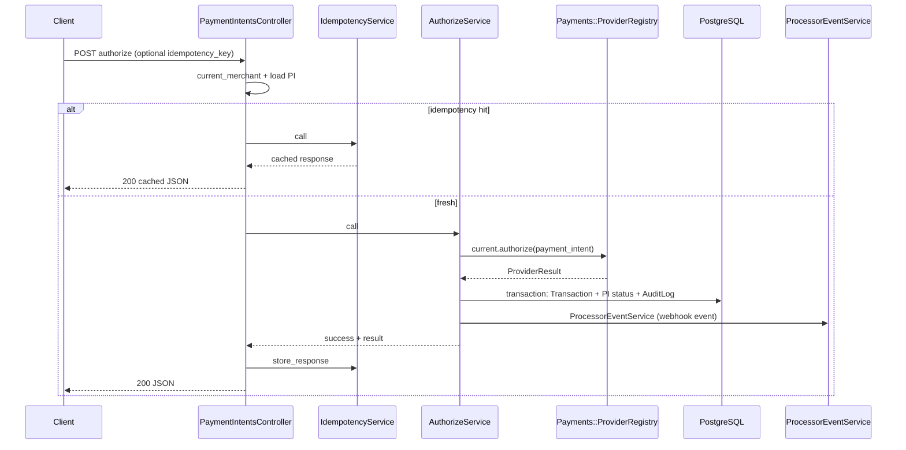
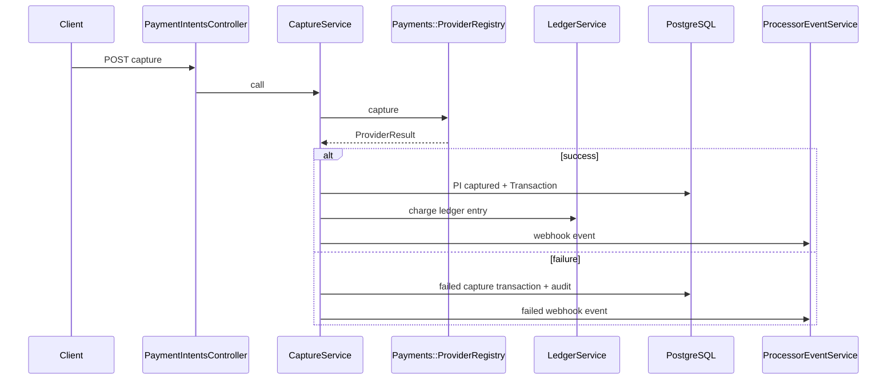

# Sequence documentation — payment flows

Concrete flows as implemented. Controllers differ slightly between **API** and **Dashboard** (`Api::V1::PaymentIntentsController` vs `Dashboard::PaymentIntentsController`), but both delegate to the **same services**.

**Provider note:** `AuthorizeService`, `CaptureService`, `VoidService`, and `RefundService` call `payment_provider` (`Payments::ProviderRegistry.current`) inside `Timeout.timeout`.  
- `simulated` → randomized outcome in `SimulatedAdapter`  
- `stripe_sandbox` → Stripe HTTP via `StripeAdapter`  

---

## 1. Authorize (`POST …/authorize`)

### Entry points

- API: `Api::V1::PaymentIntentsController#authorize`
- Dashboard: `Dashboard::PaymentIntentsController#authorize` (same pattern)

### Steps (API)

1. **Resolve tenant:** `current_merchant` from `X-API-KEY` (`ApiAuthenticatable`).
2. **Load intent:** `payment_intent = current_merchant.payment_intents.find(params[:id])`.
3. **Idempotency (optional):** If `idempotency_key` present:
   - `IdempotencyService.call(merchant:, idempotency_key:, endpoint: 'authorize', request_params: { payment_intent_id: … })`
   - If `result[:cached]` → return stored `response_body` + `status_code` (**no second service call**).
4. **Service:** `AuthorizeService.call(payment_intent:, idempotency_key:)`
   - Validates PI `status == 'created'`.
   - Calls `payment_provider.authorize(payment_intent:)` under timeout.
     - Catches `Timeout::Error` → failure_code `timeout`.
     - Catches `Payments::ProviderRequestError` → `provider_error` + message.
   - On provider failure without timeout: uses adapter `failure_code` / `failure_message` when present.
   - **DB transaction:**
     - `transactions.create!(kind: 'authorize', status: succeeded|failed, amount_cents:, processor_ref: from adapter, failure_*)`
     - Success → `payment_intent.update!(status: 'authorized')` + `create_audit_log` (`payment_authorized`) + `trigger_webhook_event` → `ProcessorEventService`
     - Failure → `payment_intent.update!(status: 'failed')` + audit + webhook for failure
5. **Controller:** On success, builds JSON (`serialize_transaction`, `serialize_payment_intent`), `idempotency.store_response`, `200`.

### Ledger / webhooks

- **No ledger** on authorize (by design).
- **Outbound merchant webhook:** `WebhookTriggerable` → `ProcessorEventService` → `WebhookEvent` (`pending`) + signature → `WebhookDeliveryJob` after commit.

### Mermaid (authorize)

---

## 2. Capture (`POST …/capture`)

### Steps (same controller pattern as authorize)

1. Tenant + load PI.
2. Optional idempotency (`endpoint: 'capture'`).
3. `CaptureService.call`
   - Requires PI `status == 'authorized'`.
   - Rejects if a **succeeded** `capture` already exists.
   - Provider `capture` under timeout (same error mapping as authorize).
   - **DB transaction:**
     - `Transaction(capture, …)`
     - Success → `payment_intent.update!(status: 'captured')` + **`LedgerService.call(entry_type: 'charge')`** + audit + webhook success path
     - Failure → audit + webhook failure path (no ledger on failure)

### Mermaid (capture)

---

## 3. Refund (`POST …/refunds`)

### Entry

- API only in routes: `Api::V1::RefundsController#create` nested under `payment_intents`.

### Steps

1. `current_merchant` + load PI; require `status == 'captured'`.
2. Compute `amount_cents` (body or full refundable).
3. Validate against `refundable_cents`.
4. Optional idempotency (`endpoint: 'refund'`, params include amount).
5. `RefundService.call(payment_intent:, amount_cents:, idempotency_key:)`
   - Provider `refund` under timeout.
   - **DB transaction:** `Transaction(refund)` + on success **`LedgerService` with negative amount** + audit + webhook.

---

## 4. Void (`POST …/void`)

### Steps

1. Same idempotency pattern as authorize/capture (`endpoint: 'void'`).
2. `VoidService.call`
   - Allowed PI status: `created` **or** `authorized`.
   - Provider `void` under timeout.
   - **No ledger** on success (funds never settled as charge in this model).
   - Success → `payment_intent.update!(status: 'canceled')` + audit (includes `Auditable`).

> **Note:** `VoidService` does not include `WebhookTriggerable` in the current codebase — no automatic `ProcessorEventService` call from void (unlike authorize/capture/refund). If you add it later, document here.

---

## Cross-cutting: `ProcessorEventService` vs inbound `WebhooksController`

| Path | Purpose |
|------|---------|
| **Payment services** → `ProcessorEventService` | Creates **outbound-style** `WebhookEvent` for **merchants** (signed with app `webhook_secret`) |
| **`POST /api/v1/webhooks/processor`** | **Inbound** processor events; signature verified by **payment provider adapter**; payload normalized before `WebhookEvent.create!` |

Both may enqueue `WebhookDeliveryJob`, but the job **no-ops** unless `delivery_status == 'pending'` (inbound processor handler often marks `succeeded` immediately).
