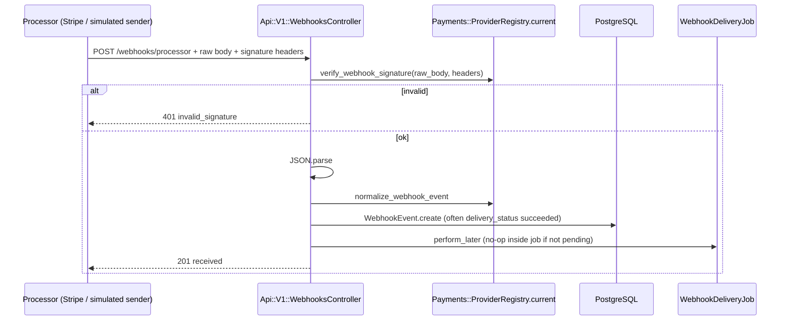
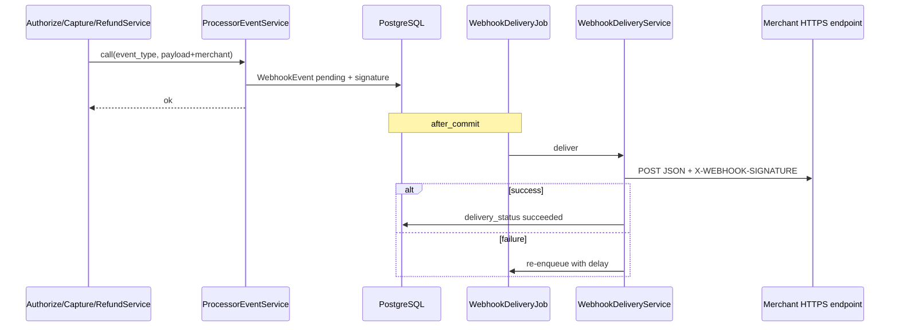

# Sequence documentation — webhook flows

Two distinct webhook stories exist in code:

1. **Inbound processor webhook** — external system posts to **`POST /api/v1/webhooks/processor`**
2. **Outbound merchant webhook** — gateway notifies the **merchant’s** endpoint about payment lifecycle events

Plus: **internal** event creation via `ProcessorEventService` when payment services call `WebhookTriggerable`.

---

## 1. Inbound processor webhook (`Api::V1::WebhooksController#processor`)

### Steps (current implementation)

1. **Read raw body:** `payload_body = request.body.read` (important for signature verification).
2. **Verify signature:** `Payments::ProviderRegistry.current.verify_webhook_signature(payload: payload_body, headers: request.headers.to_h)`
   - **Simulated / legacy app secret path:** effectively HMAC over raw body vs `X-WEBHOOK-SIGNATURE` (see `SimulatedAdapter`)
   - **Stripe sandbox:** `Stripe-Signature` header + `STRIPE_WEBHOOK_SECRET` (see `StripeAdapter`)
3. **Parse JSON** → `payload` hash.
4. **Normalize:** `normalize_webhook_event(payload:, headers:)` → internal `event_type`, `merchant_id`, normalized `payload`, `signature` string for storage.
5. **Persist:** `WebhookEvent.create!(merchant:, event_type:, payload:, delivery_status: 'succeeded', delivered_at: now, signature:)`
   - Inbound is treated as **already delivered to us** (`succeeded`).
6. **Side effect:** e.g. `chargeback.opened` → may `update!` `payment_intent.dispute_status` when `merchant_id` + `payment_intent_id` resolvable.
7. **`WebhookDeliveryJob.perform_later(webhook_event.id)`** is still enqueued via `WebhookEvent` `after_commit`, but the job **returns immediately** if `delivery_status != 'pending'`.

### Mermaid

---

## 2. Outbound merchant webhook (payment lifecycle)

### Trigger

`WebhookTriggerable#trigger_webhook_event` (used from `AuthorizeService`, `CaptureService`, `RefundService` on success/failure paths) builds a **canonical internal payload** (`event_type`, `data.merchant_id`, transaction fields, etc.) and calls:

`ProcessorEventService.call(event_type:, payload: payload.merge(merchant: …))`

### `ProcessorEventService`

1. Validates `event_type` ∈ allowed set (`transaction.succeeded`, `transaction.failed`, `chargeback.opened`, …).
2. `WebhookEvent.create!(merchant:, event_type:, payload:, delivery_status: 'pending')`
3. Computes **HMAC** signature using `WebhookSignatureService.generate_signature` + `Rails.application.config.webhook_secret`
4. Stores signature on `WebhookEvent`
5. `after_commit` → **`WebhookDeliveryJob.perform_later`**

### `WebhookDeliveryJob` + `WebhookDeliveryService`

1. Job loads `WebhookEvent`; skips if not `pending`.
2. `WebhookDeliveryService` POSTs JSON to `MERCHANT_WEBHOOK_URL` (if blank, marks event succeeded with `reason: no_url_configured`).
3. Retries with backoff on failure (`exponentially_longer`, max attempts).

### Mermaid

---

## Duplicate delivery / idempotency

- **Inbound:** Provider may retry; app stores each received event as a row — **no built-in idempotency on `provider_event_id`** in `WebhookEvent` today. Operational handling is “at least once” at the HTTP edge.
- **Outbound:** Retries come from `WebhookDeliveryService` / job; merchants should treat events as retryable and verify signature + idempotency on their side.

---

## Configuration pointers

| Concern | Where |
|---------|--------|
| Outbound signing secret | `config/initializers/webhook_config.rb` → `Rails.application.config.webhook_secret` |
| Merchant URL | `ENV['MERCHANT_WEBHOOK_URL']` (used by `WebhookDeliveryService`) |
| Inbound Stripe | `STRIPE_WEBHOOK_SECRET` + `PAYMENTS_PROVIDER=stripe_sandbox` |
| Provider docs | [PAYMENT_PROVIDER_SANDBOX.md](PAYMENT_PROVIDER_SANDBOX.md) |
