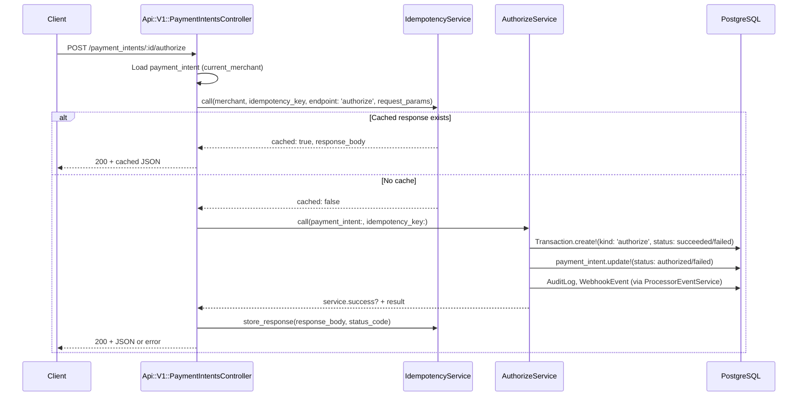
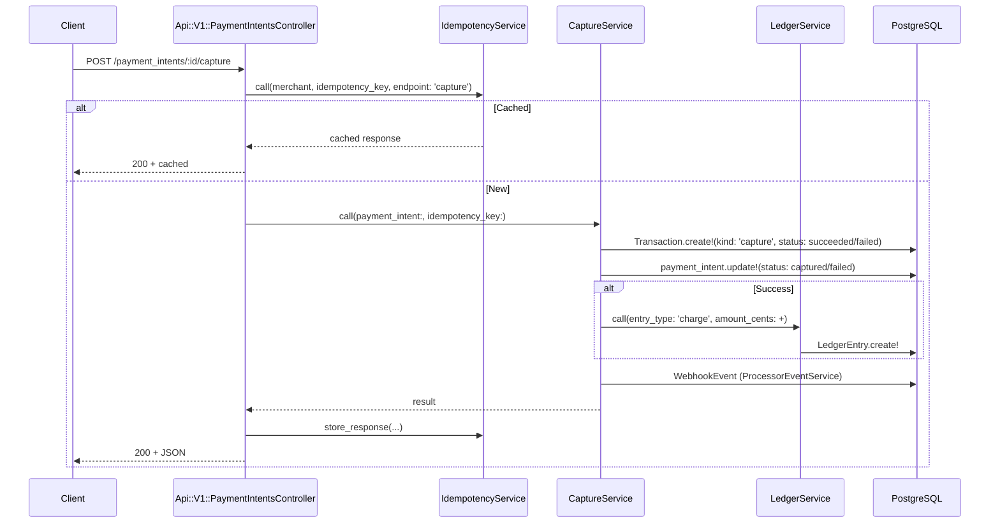
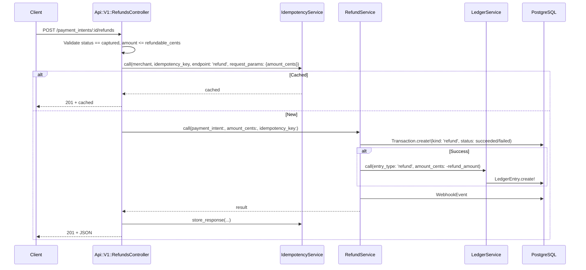
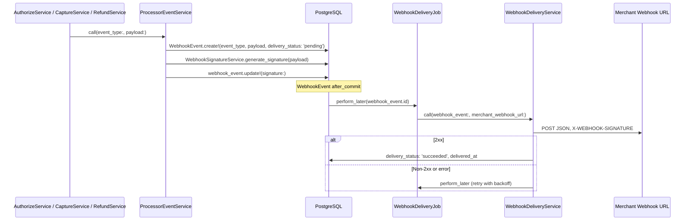
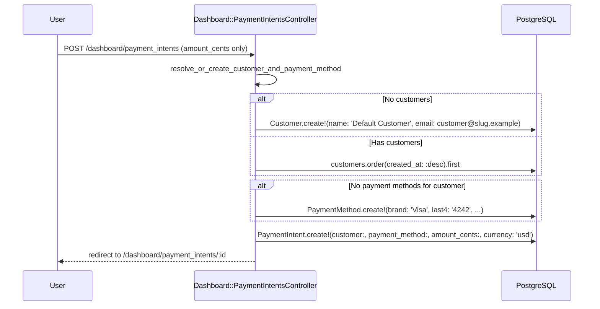
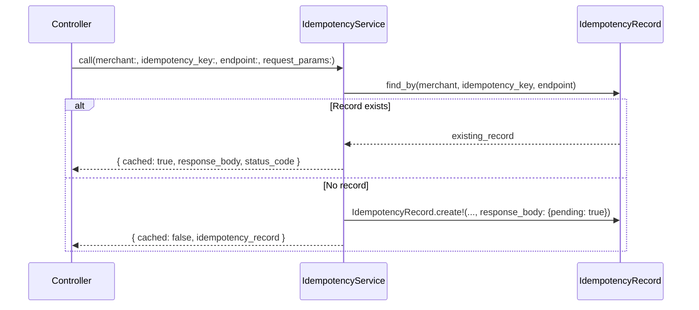

# Mini Payment Gateway – Sequence Diagrams

Mermaid diagrams for key flows. Use a Mermaid-capable viewer (e.g. GitHub, VS Code extension) to render.

---

## 1. Authorize Flow (API)

---

## 2. Capture Flow (with Ledger)

---

## 3. Refund Flow (Partial/Full)

---

## 4. Webhook Delivery (Async)

---

## 5. Dashboard Create Payment Intent (Simplified)

---

## 6. Idempotency Lookup

